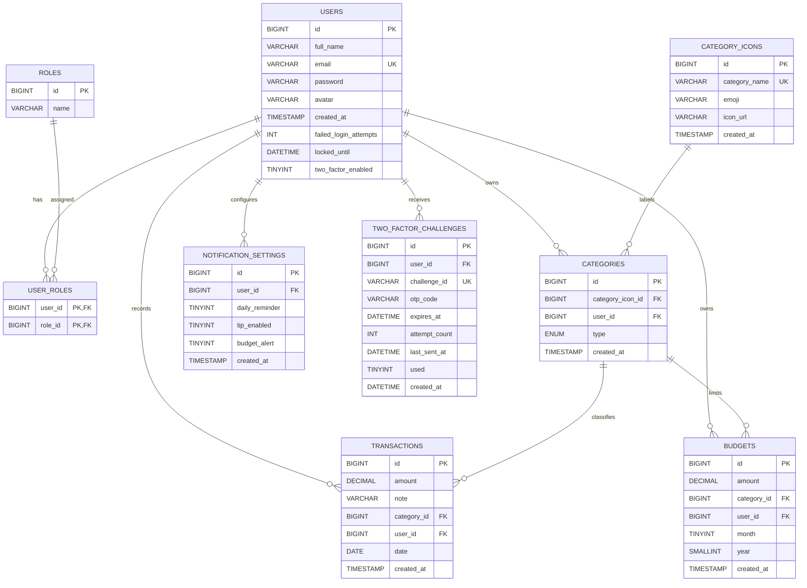

# Personal Finance Tracker (PFT)

## Project Overview

Personal Finance Tracker is a Spring Boot backend for managing personal income, expenses, budgets, reports, and account security. It provides REST APIs for user registration, JWT authentication, user-owned categories and transactions, dashboard summaries, monthly financial reports, PDF export, email report delivery, and notification settings.

The backend is responsible for authentication, authorization, financial data persistence, business rule validation, report calculation, local PDF generation, and SMTP-based email delivery.

## E-R Diagram

The schema is managed by Flyway migrations in `src/main/resources/db/migration`.



## Tech Stack

| Area | Technology |
|---|---|
| Language | Java 17 |
| Framework | Spring Boot 4.1.0 |
| Web | Spring Web MVC |
| Persistence | Spring Data JPA, Hibernate |
| Security | Spring Security, method security, BCrypt |
| Authentication | JWT with JJWT 0.12.5 |
| Database | MySQL |
| Migrations | Flyway, Flyway MySQL |
| Email | Spring Boot Mail, JavaMailSender |
| PDF export | OpenPDF 2.0.3 |
| Chart generation | JFreeChart 1.5.6 |
| Validation | Jakarta Bean Validation |
| Boilerplate reduction | Lombok |
| Test database | H2 |
| Testing | JUnit 5, Mockito, MockMvc, Spring Security Test |
| Coverage | JaCoCo Maven Plugin 0.8.15 |
| Build | Maven Wrapper, Maven 3.9.16 |

## Modules

| Module | Description |
|---|---|
| Authentication | Registration, login, JWT issuance, account lockout, and email-based 2FA. |
| User Management | Profile update, avatar update, and 2FA preference update. |
| Category Management | User-owned income and expense categories backed by seeded category icons. |
| Transaction Management | Creation and paginated history lookup for user transactions. |
| Dashboard | Monthly income, expense, balance, pie chart data, and recent transactions. |
| Budget Management | Monthly budget management for expense categories. |
| Financial Reports | Summary, monthly, and category breakdown reports. |
| PDF Export | Local PDF generation for summary, monthly, and category reports. |
| Report Email Delivery | Summary PDF generation in memory and email attachment delivery. |
| Notification Settings | Daily reminder, tips, and budget alert preferences. |

## Features

### Authentication and User Management

- Users can register with `email`, `password`, and `fullName`.
- Passwords must be at least 8 characters and contain both letters and numbers.
- Registered users receive the default `USER` role and a notification settings row.
- Login returns a JWT immediately when 2FA is disabled.
- If 2FA is enabled on the user profile, login returns a `challengeId` instead of a token.
- Failed login attempts are counted. The account is locked for 30 minutes after 5 failed attempts.
- JWTs include the user's email as subject, configured issuer, expiration, and role claims.
- `PUT /api/user/profile` updates full name, avatar, and the `twoFactorEnabled` flag. This endpoint requires `ROLE_USER`.

### Category Management

- Categories are owned by the authenticated user.
- Supported category types are `INCOME` and `EXPENSE`.
- Category names are selected from seeded `category_icons`.
- When `emoji` is blank, the service looks up the icon by category `name`.
- When `emoji` is provided, the service looks up the icon by emoji.
- Duplicate category names are rejected per user.

### Transaction Management

- Users can create transactions with positive amount, optional note, category, and date.
- The selected category must belong to the authenticated user.
- Transaction history is filtered by date range, type, and optional category.
- Pagination defaults to page `1` and size `10`; size is limited to `20`.
- History requires `startDate`, `endDate`, and `type`.

### Dashboard

- Dashboard data is calculated for a selected month and year.
- If month or year is omitted, the request DTO defaults to the current month and year.
- The response includes total income, total expense, balance, pie chart data, and 3 recent transactions.
- Recent expense amounts are returned as negative values; income amounts are returned as positive values.

### Budget Management

- Budgets are scoped to the authenticated user.
- Budgets can only be created for `EXPENSE` categories.
- Creating a budget is an upsert by user, category, month, and year.
- Updating and deleting budgets uses user ownership checks; another user's budget is treated as not found.

### Financial Reports

- Category reports group totals by category for a selected `INCOME` or `EXPENSE` type and calculate percentages.
- Monthly reports return 12 months of income and expense chart data for the selected year, plus a selected month summary.
- Summary reports return monthly income, expense, balance, and the top 3 expense categories.
- Empty totals are normalized to `0`.

### PDF Export

- PDF export supports `SUMMARY`, `MONTHLY`, and `CATEGORY`.
- The default report type is `SUMMARY` when the field is omitted or blank.
- Exported PDFs are written under `reports/`.
- File names follow `<userId>_<reportType>_<month-short-name>_<year>.pdf`.
- Optional `includeChart` and `includeTopExpenses` flags control additional PDF sections where supported.

### Report Email Delivery

- Email export creates a summary PDF in memory and sends it as an attachment.
- The email request requires `month`, `year`, and destination `email`.
- SMTP settings must be configured for OTP emails and report delivery.

### Notification Settings

- Users can read and update notification settings.
- Supported flags are `dailyReminder`, `tipsEnabled`, and `budgetAlert`.
- The application-created defaults are all `false`.

## Installation & Run

### Prerequisites

- JDK 17.
- MySQL 8.x. The migrations use `utf8mb4_0900_ai_ci`, which is a MySQL 8 collation.
- Maven Wrapper from this repository. It downloads Maven 3.9.16 when needed.
- SMTP credentials for login OTP and report email workflows.

### Environment Configuration

Runtime configuration is defined in `src/main/resources/application.properties`.

| Variable | Purpose | Required | Safe example value |
|---|---|---|---|
| `DB_URL` | JDBC URL for the MySQL database. Defaults to local `pft`. | No | `jdbc:mysql://localhost:3306/pft?useSSL=false&allowPublicKeyRetrieval=true` |
| `DB_USERNAME` | MySQL username. Defaults to `root`. | No | `pft_user` |
| `DB_PASSWORD` | MySQL password. Defaults to an empty value. | No | `change-me` |
| `SECRET_KEY` | Base64 JWT signing key. Must decode to at least 32 bytes. | Yes | `base64-encoded-32-byte-secret` |
| `MAIL_USERNAME` | SMTP username. Used by OTP and report email delivery. | Yes | `your-account@example.com` |
| `MAIL_PASSWORD` | SMTP password or app password. | Yes | `app-specific-password` |

JWT defaults:

| Property | Value |
|---|---|
| `app.jwt.expiration-seconds` | `3600` |
| `app.jwt.issuer` | `pft` |

Generate a development JWT secret in PowerShell:

```powershell
[Convert]::ToBase64String([Security.Cryptography.RandomNumberGenerator]::GetBytes(32))
```

Set local environment variables before starting the backend:

```powershell
$env:DB_URL = "jdbc:mysql://localhost:3306/pft?useSSL=false&allowPublicKeyRetrieval=true"
$env:DB_USERNAME = "pft_user"
$env:DB_PASSWORD = "<database-password>"
$env:SECRET_KEY = "<base64-encoded-secret>"
$env:MAIL_USERNAME = "<smtp-username>"
$env:MAIL_PASSWORD = "<smtp-password>"
```

Do not commit real secrets or SMTP credentials.

### Database Setup with Flyway

Create an empty MySQL database before starting the application:

```sql
CREATE DATABASE pft CHARACTER SET utf8mb4 COLLATE utf8mb4_0900_ai_ci;
```

Flyway is enabled by default, and Hibernate is configured with schema validation:

```properties
spring.flyway.enabled=true
spring.jpa.hibernate.ddl-auto=validate
```

Hibernate validates the schema after Flyway has run. It does not create missing tables.

| Migration | Verified behavior |
|---|---|
| `V1__create_schema.sql` | Creates the initial schema with 9 tables: `roles`, `category_icons`, `users`, `categories`, `budgets`, `transactions`, `user_roles`, `notification_settings`, and `two_factor_challenges`. |
| `V2__seed_roles.sql` | Seeds 2 roles: `ADMIN` and `USER`. |
| `V3__seed_category_icons.sql` | Seeds 12 category icons: Housing, Food, Shopping, Salary, Freelance, Investments, Other, Transportation, Entertainment, Health, Education, and Gifts. |

Fresh database:

1. Create an empty MySQL database.
2. Configure the environment variables.
3. Start the application.
4. Flyway automatically runs all pending migrations.
5. Hibernate validates the resulting schema.

Existing database:

- An existing schema may require a verified Flyway baseline before migrations can be enabled safely.
- The development database was previously baselined at version 3 because its schema and seed data already existed.
- Do not treat baseline version 3 as correct for every database.
- Do not enable automatic baselining globally without proving that the existing database matches the skipped migrations.

Check Flyway history:

```sql
SELECT version, description, success, installed_on
FROM flyway_schema_history
ORDER BY installed_rank;
```

### Running the Application

Clone the repository:

```powershell
git clone https://github.com/PPhTan165/Mock-PFT-R2S.git
cd Mock-PFT-R2S
```

Start the backend with the Maven Wrapper:

```powershell
.\mvnw.cmd spring-boot:run
```

On macOS or Linux:

```bash
./mvnw spring-boot:run
```

Verify startup by checking application logs for successful Flyway migration and Hibernate schema validation. No health endpoint, Swagger UI, or OpenAPI route is configured in the repository.

## API Root Endpoint

The application does not set `server.port`, so Spring Boot uses the default port unless overridden externally.

| Item | Value |
|---|---|
| Local base URL | `http://localhost:8080` |
| Authentication base path | `/api/auth` |
| Protected API base paths | `/api/user`, `/api/categories`, `/api/transactions`, `/api/dashboard`, `/api/budgets`, `/api/reports`, `/api/notifications/settings` |

Protected endpoints require:

```http
Authorization: Bearer <accessToken>
```

## API Module Endpoints

### Authentication APIs

| Method | Endpoint | Description | Auth |
|---|---|---|---|
| `POST` | `/api/auth/register` | Register a user and create notification settings. | Public |
| `POST` | `/api/auth/login` | Login with email and password. Returns JWT or 2FA challenge. | Public |
| `POST` | `/api/auth/2fa/verify` | Verify a 6-digit OTP and issue JWT. | Public |
| `POST` | `/api/auth/2fa/resend` | Resend OTP for an active challenge. Returns `204 No Content`. | Public |

### User APIs

| Method | Endpoint | Description | Auth |
|---|---|---|---|
| `PUT` | `/api/user/profile` | Update full name, avatar, and 2FA preference. | JWT, `ROLE_USER` |

### Category APIs

| Method | Endpoint | Description | Auth |
|---|---|---|---|
| `GET` | `/api/categories` | List current user's categories grouped by type. | JWT |
| `GET` | `/api/categories?type=EXPENSE` | List current user's categories for one type. | JWT |
| `POST` | `/api/categories` | Create a current-user category from a seeded category icon. | JWT |

### Transaction APIs

| Method | Endpoint | Description | Auth |
|---|---|---|---|
| `POST` | `/api/transactions` | Create a transaction for a current-user category. | JWT |
| `GET` | `/api/transactions/history` | Query transaction history by date range, type, optional category, page, and size. | JWT |

### Dashboard APIs

| Method | Endpoint | Description | Auth |
|---|---|---|---|
| `GET` | `/api/dashboard?month=9&year=2026` | Get monthly income, expense, balance, pie chart data, and recent transactions. | JWT |

### Budget APIs

| Method | Endpoint | Description | Auth |
|---|---|---|---|
| `POST` | `/api/budgets` | Create or replace a budget for an expense category. | JWT |
| `GET` | `/api/budgets?month=9&year=2026` | List current user's budgets for a month and year. | JWT |
| `PUT` | `/api/budgets/{id}` | Update a current-user budget amount. | JWT |
| `DELETE` | `/api/budgets/{id}` | Delete a current-user budget. Returns `204 No Content`. | JWT |

### Report APIs

| Method | Endpoint | Description | Auth |
|---|---|---|---|
| `GET` | `/api/reports/category?month=9&year=2026&type=EXPENSE` | Get category totals and percentages for `INCOME` or `EXPENSE`. | JWT |
| `GET` | `/api/reports/monthly?month=9&year=2026` | Get 12-month chart data and selected month summary. | JWT |
| `GET` | `/api/reports/summary?month=9&year=2026` | Get monthly income, expense, balance, and top expenses. | JWT |
| `POST` | `/api/reports/export/pdf` | Generate a local PDF report. | JWT |
| `POST` | `/api/reports/export/email` | Send a summary PDF report by email. | JWT |

### Notification APIs

| Method | Endpoint | Description | Auth |
|---|---|---|---|
| `GET` | `/api/notifications/settings` | Read current user's notification settings. | JWT |
| `PUT` | `/api/notifications/settings` | Update current user's notification settings. | JWT |

## Sample API Requests and Responses

### 1. Register

```http
POST /api/auth/register
Content-Type: application/json
```

```json
{
  "email": "user@example.com",
  "password": "abcd1234",
  "fullName": "Example User"
}
```

```json
{
  "success": true,
  "message": "Registration successful",
  "data": {
    "userId": 1,
    "fullName": "Example User",
    "email": "user@example.com"
  }
}
```

### 2. Login Without 2FA

```http
POST /api/auth/login
Content-Type: application/json
```

```json
{
  "email": "user@example.com",
  "password": "abcd1234"
}
```

```json
{
  "success": true,
  "message": "Login successful",
  "challengeId": null,
  "data": {
    "accessToken": "<jwt>",
    "expired": "2026-09-29T12:00:00"
  }
}
```

### 3. Login With 2FA Enabled

When `twoFactorEnabled` is `true`, login returns a challenge first:

```json
{
  "success": true,
  "message": "Two-factor verification required",
  "challengeId": "b1c6b3f6-2bb8-4b5c-aad8-1a1d1d5a1111",
  "data": null
}
```

Verify the email OTP:

```http
POST /api/auth/2fa/verify
Content-Type: application/json
```

```json
{
  "challengeId": "b1c6b3f6-2bb8-4b5c-aad8-1a1d1d5a1111",
  "code": "123456"
}
```

Successful verification returns the same login success structure with `data.accessToken`.

### 4. Create a Transaction

```http
POST /api/transactions
Authorization: Bearer <accessToken>
Content-Type: application/json
```

```json
{
  "amount": 125000.50,
  "note": "Lunch",
  "categoryId": 20,
  "date": "2026-09-07"
}
```

```json
{
  "success": true,
  "message": "Transaction added successfully",
  "data": {
    "id": 15,
    "amount": 125000.50,
    "note": "Lunch",
    "category": {
      "id": 20,
      "name": "Food",
      "type": "EXPENSE",
      "icon": "<stored-icon-value>",
      "iconUrl": "https://cdn.example.com/icons/food.png"
    },
    "date": "2026-09-07"
  }
}
```

### 5. Create a Budget

```http
POST /api/budgets
Authorization: Bearer <accessToken>
Content-Type: application/json
```

```json
{
  "categoryId": 20,
  "amount": 1000000,
  "month": 9,
  "year": 2026
}
```

```json
{
  "success": true,
  "message": "Budget saved successfully",
  "data": {
    "id": 4,
    "category": {
      "id": 20,
      "name": "Food",
      "icon": "<stored-icon-value>",
      "iconUrl": "https://cdn.example.com/icons/food.png"
    },
    "amount": 1000000,
    "month": 9,
    "year": 2026,
    "type": "EXPENSE"
  }
}
```

### 6. Request a Summary Report

```http
GET /api/reports/summary?month=9&year=2026
Authorization: Bearer <accessToken>
```

```json
{
  "success": true,
  "message": "Monthly summary fetched successfully",
  "data": {
    "month": "September",
    "year": 2026,
    "income": 5000000,
    "expense": 1250000,
    "balance": 3750000,
    "topExpenses": [
      {
        "category": "Food",
        "icon": "<stored-icon-value>",
        "iconUrl": "https://cdn.example.com/icons/food.png",
        "amount": 750000,
        "percentage": 60.00
      }
    ]
  }
}
```

## Important Usage Notes

| Area | Note |
|---|---|
| JWT | Protected endpoints require `Authorization: Bearer <accessToken>`. |
| Account lockout | 5 failed login attempts lock the account for 30 minutes. |
| 2FA | OTP codes are 6 digits, expire after 5 minutes, allow up to 5 verification attempts, and have a 60-second resend cooldown. |
| Category ownership | Transactions and budgets validate category ownership against the current authenticated user. |
| Category types | Only `INCOME` and `EXPENSE` are supported. |
| Budget category | Budgets can only be created for `EXPENSE` categories. |
| Budget upsert | Creating a budget for the same user, category, month, and year replaces the amount. |
| Transaction history | Requires `startDate`, `endDate`, `type`, `page`, and `size`; defaults exist for page and size when omitted. |
| Date range | Transaction history rejects `startDate` after `endDate`. |
| Report periods | Dashboard, budget list, monthly report, and summary report default missing month/year to the current period. |
| PDF export | `month` and `year` are required; valid report types are `SUMMARY`, `MONTHLY`, and `CATEGORY`. |
| Email export | Always sends a summary PDF attachment, even though chart and top-expense flags can be included. |
| Seed data | Category icon URLs are placeholder `cdn.example.com` values in the migration data. |

## Testing & Coverage

The repository includes controller security tests, service tests, repository isolation tests, DTO validation tests, exception tests, JWT tests, helper tests, PDF renderer tests, and chart service tests.

The test profile uses H2:

```properties
spring.datasource.url=jdbc:h2:mem:pft_test;MODE=MySQL;DATABASE_TO_LOWER=TRUE;NON_KEYWORDS=MONTH,YEAR;DB_CLOSE_DELAY=-1;DB_CLOSE_ON_EXIT=FALSE
spring.jpa.hibernate.ddl-auto=create-drop
```

Run the full test suite:

```powershell
.\mvnw.cmd test
```

Run one selected test class:

```powershell
.\mvnw.cmd -Dtest=BudgetServiceImplTest test
```

Run Maven verification and generate JaCoCo reports:

```powershell
.\mvnw.cmd verify
```

On macOS or Linux, use `./mvnw` instead of `.\mvnw.cmd`.

Report locations:

| Report | Location |
|---|---|
| Surefire reports | `target/surefire-reports/` |
| JaCoCo HTML | `target/site/jacoco/index.html` |
| JaCoCo XML and CSV | `target/site/jacoco/` |

JaCoCo measures executed code coverage. It does not prove complete business correctness or security coverage.

## Contributors

- [@PPhTan165](https://github.com/PPhTan165)
